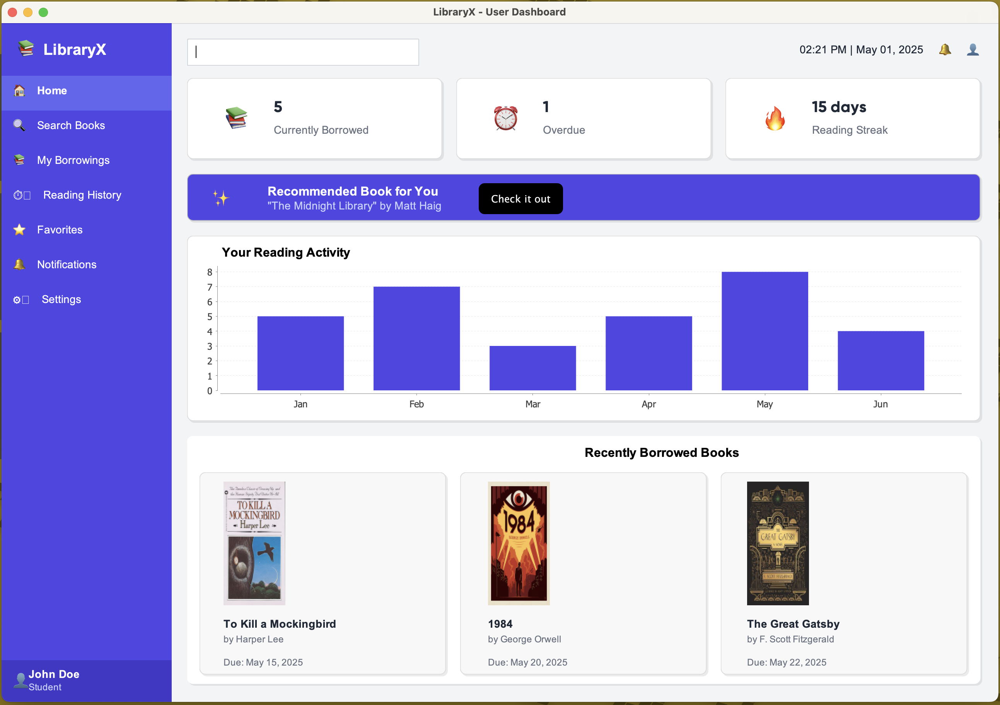
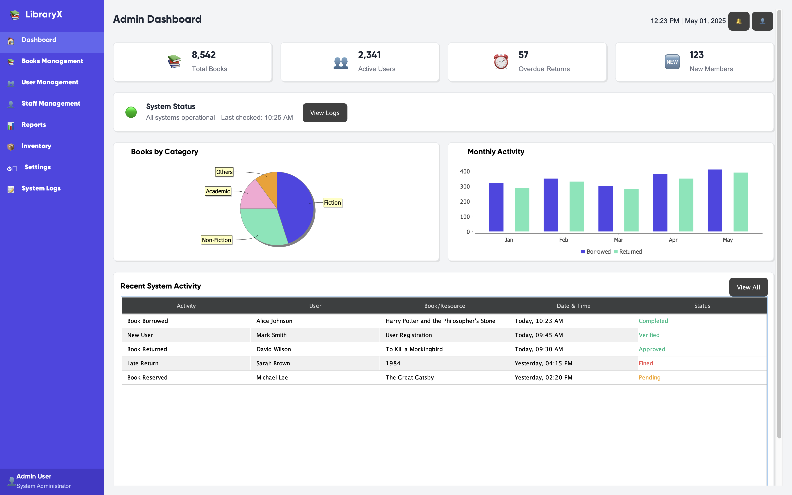
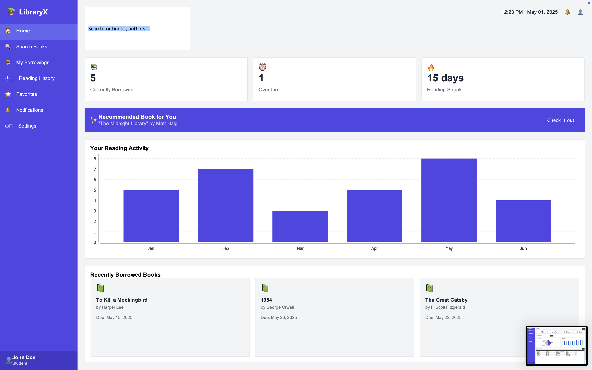
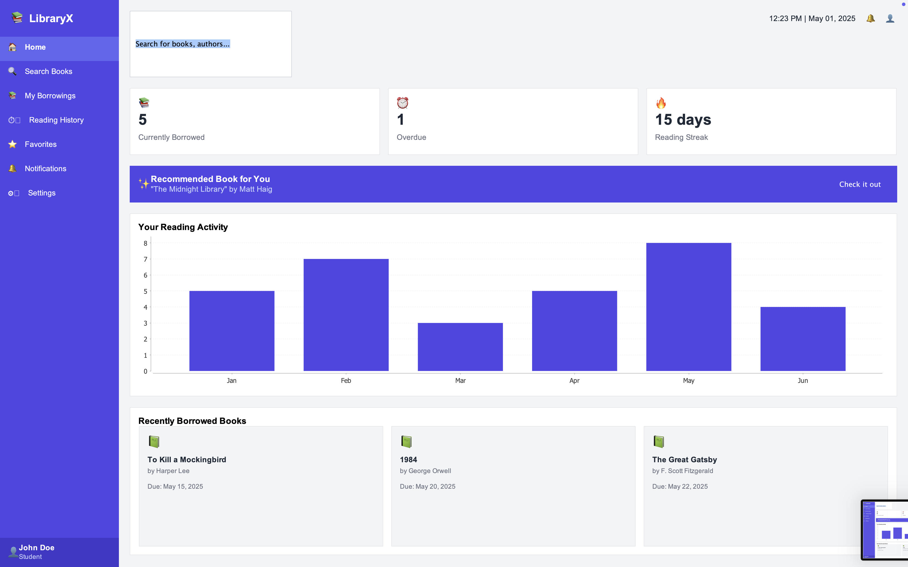
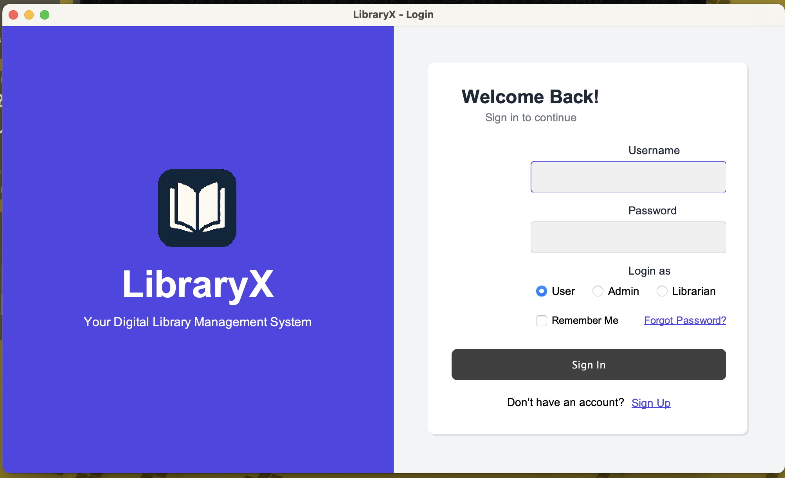

<p align="center">
  
</p>

<h1 align="center">LibraryX</h1>
<p align="center"><strong>A Library Management System built using Java Swing</strong></p>

<p align="center">
  <a href="https://visitor-badge.laobi.icu/badge?page_id=libraryx-repo"></a>
</p>

---

## Overview

**LibraryX** is a desktop-based Library Management Application built with **Java Swing**, offering an intuitive interface for managing books, users, and administrative operations. It provides role-based dashboards to streamline all common library operations:

- Issue / Return books
- Maintain inventory of books
- Manage user database
- Track issued books and due dates

---

## Features

- **User Dashboard**
  - View available books
  - Issue and return books
  - View current and past borrowings

- **Librarian Dashboard**
  - Add and manage books
  - Issue and return books on behalf of users
  - Track overdue returns

- **Admin Dashboard**
  - Manage librarian and user accounts
  - Generate reports
  - Control global system settings

---

## Screenshots

<p align="center">
  
  <br/><br/>
  
  <br/><br/>
  
  <br/><br/>
  
  <br/><br/>
  
  <br/><br/>
  
</p>

---

## Tech Stack

- Java
- Java Swing
- JDBC (for database connectivity)
- MySQL

---

## Getting Started

1. **Clone the repository**

   ```bash
   git clone https://github.com/yourusername/LibraryX.git
   ```
2. **Open in your preferred IDE** (e.g., IntelliJ IDEA or Eclipse)

3. **Set up the database**

   - Configure the connection string in the database utility file
   - Run the schema SQL file if provided

4. **Run the application**

   - Locate the `Main.java` file and run the project

---

## License

This project is licensed under the [MIT License](LICENSE).

---

## Contact

For any queries or suggestions, please reach out to:

**Email:** by.yashdagar@gmail.com

---

_Made with_ ❤️ _by **Rudransh**, **Vanshika**, and **Yash**._
